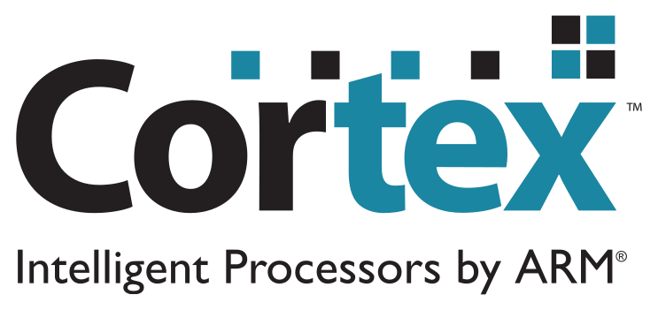

<p align="center">
  
</p>

# libhal-armcortex

[](https://github.com/libhal/libhal-armcortex/actions/workflows/ci.yml)
[](https://libhal.github.io/libhal-armcortex/coverage/)
[](https://www.codacy.com/gh/libhal/libhal-armcortex/dashboard?utm_source=github.com&amp;utm_medium=referral&amp;utm_content=libhal/libhal-armcortex&amp;utm_campaign=Badge_Grade)
[](https://github.com/libhal/libhal-armcortex/stargazers)
[](https://github.com/libhal/libhal-armcortex/network)
[](https://github.com/libhal/libhal-armcortex/issues)
[](https://github.com/libhal/libhal-armcortex/blob/main/conanfile.py)
[](https://conan.io/center/libhal-armcortex)

# [📚 Software APIs](https://libhal.github.io/libhal-armcortex/api)

Drivers for ARM cortex-m series micro-controllers. Currently supports:

* Cortex-M4
* Cortex-M4F

> Plan to support all of the other Cortex M series chips very soon!

# Setup

## [Installing libhal prereqs](https://libhal.github.io/setup/)

# Using Arm GNU Toolchain

```
[tool_requires]
gnu-arm-embedded-toolchain/11.3.0
```

# Usage

## Initializing RAM and co-processors

Before an embedded application can properly start, it needs to initialize its
RAM and any other co-processors it may need at runtime.
